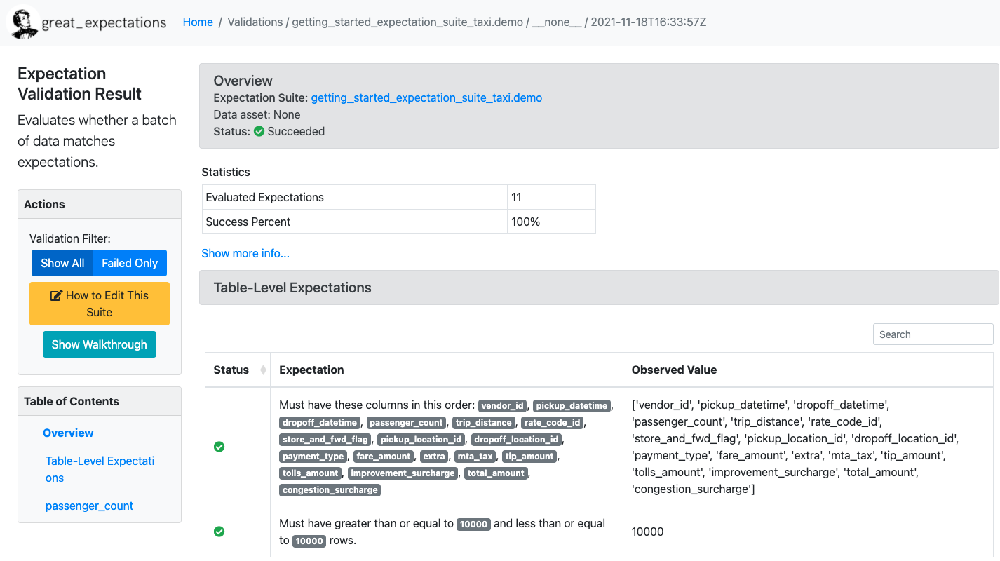
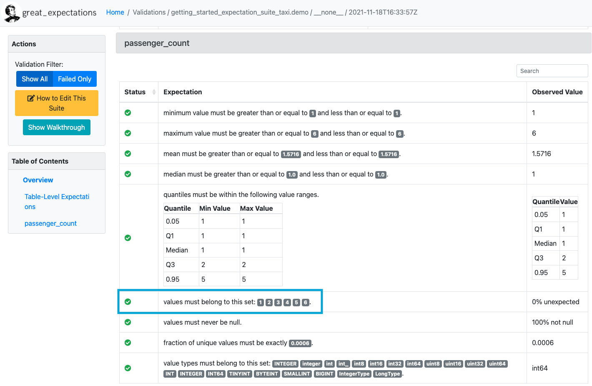

Data Docs translate Expectations, Validation Results, and other metadata into clean, human-readable documentation. Automatically compiling your data documentation from your data tests in the form of Data Docs guarantees that your documentation will never go stale.

### Validation Results in Data Docs
In the previous steps, when you executed the last cell in the Jupyter Notebook, Great Expectations used the Expectation Suite you generated to validate the January data batch. It then compiled those Validation Results to HTML, and opened a browser window with a Data Docs Validation Results page:



The Validation Results page shows you the results of using your Expectation Suite to validate a batch of data. In this case, you see the results of validating the `yellow_tripdata_sample_2019-01` file. All Expectations were automatically generated using the Profiler functionality, which we will explain below.

If you scroll down, you will see all Expectations that were generated for the `passenger_count` column. This includes the Expectation we wanted: **“values must belong to this set: 1, 2, 3, 4, 5, 6”**.

We also see the **observed values** for this batch, which is exactly the numbers 1 through 6 that we expected. This makes sense, since we’re developing the Expectation using the January data batch.



**Feel free to click around and explore Data Docs a little more.** You will find two more interesting features:

  1. If you click on the `Home` page, you will see a list of all validation runs.

  2. The `Home` page also has a tab for your Expectation Suites, which shows you the Expectations you’ve created without any Validation Results.

For now, your static site is built and stored locally. In the last step of the tutorial, we’ll explain other options for configuring, hosting and sharing it.

### How did we get those Expectations?

You can create and edit Expectations using several different workflows. Using an automated [Profiler](/docs/reference/profilers) as we just did is one of the quickest option to get started with an Expectation Suite.

This Profiler connected to your data (using the Datasource you configured in the previous step), took a quick look at the contents of the data, and produced an initial set of Expectations. The Profiler considers the following properties, amongst others:

  - the data type of the column

  - simple statistics like column min, max, mean

  - the number of times values occur

  - the number of `NULL` values

These Expectations are not intended to be very smart. Instead, the goal is to quickly provide some good examples, so that you’re not starting from a blank slate.

<details>
  <summary>Creating Custom Expectations</summary>
  <div>
    <p>
      Later, you should also take a look at other workflows for <a href="https://docs.greatexpectations.io/docs/guides/expectations/creating_custom_expectations/how_to_create_custom_expectations">creating Custom Expectations</a>. Creating Custom Expectations is an active area of work in the Great Expectations community. Stay tuned for improvements over time.
    </p>
  </div>
</details>


### Expectations under the hood

By default, Expectation Suites are stored in a JSON file in the `expectations/` subdirectory of your `great_expectations/` folder. You can also configure Great Expectations to store Expectations to other locations, such as S3, Postgres, etc. We’ll come back to these options in the last (optional) step of the tutorial.

For example, a snippet of the JSON file for the Expectation Suite we just generated will look like this:

```json
{
  "data_asset_type": null,
  "expectation_suite_name": "getting_started_expectation_suite_taxi.demo",
  "expectations": [

    {
      "expectation_type": "expect_column_values_to_be_in_set",
      "kwargs": {
        "column": "passenger_count",
        "value_set": [
          1,
          2,
          3,
          4,
          5,
          6
        ]
      },
      "meta": {}
    },
  ...
    ]}
```

You can see that the Expectation we just looked at is represented as `expect_column_distinct_values_to_be_in_set`, with the `value_set` containing the numbers 1 through 6. This is how we store the Expectations that are shown in human-readable format in Data Docs.

**Now we only have one problem left to solve:**

How do we use this Expectation Suite to validate that **new** batch of data we have in our February dataset?

In the next step, we will complete the Great Expectations workflow by showing you how to validate a new batch of data with the Expectation Suite you just created!
